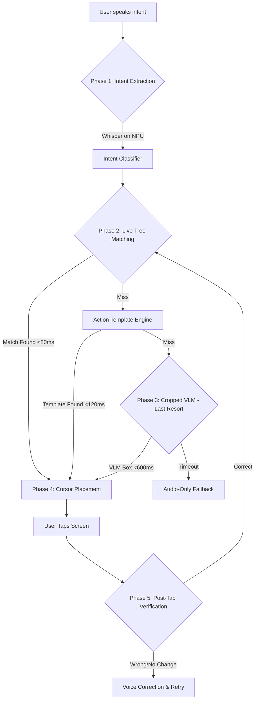
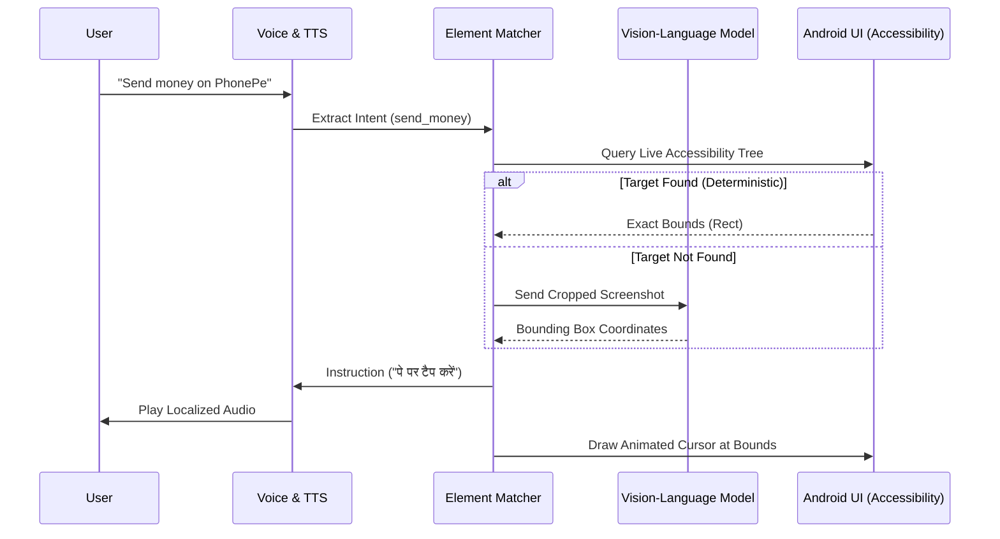

# Lumi — Multilingual On-Screen Guidance AI for Android

<div align="center">
  <p><strong>Bridging the digital divide for the next billion users.</strong></p>
</div>

[](https://kotlinlang.org)
[](https://developer.android.com)
[](LICENSE)

---

## 🌍 The Problem: The Digital Divide
Smartphones are powerful, but modern UIs are extremely complex. For non-tech-savvy users, elderly individuals, or those with lower digital literacy, simply transferring money via UPI or saving a contact can be an overwhelming task. 

Existing assistants (like Google Assistant) either perform tasks invisibly in the background (which doesn't teach the user) or open help articles that are hard to read.

## 💡 The Solution: Lumi
**Lumi** is a voice-first, multilingual, on-screen guidance assistant. Instead of doing the task *for* the user, Lumi **teaches** them how to do it. 

When a user speaks a goal in their native language (e.g., "PhonePe se paise bhejo" or "Hassan ka contact save karo"), Lumi places a friendly, animated cursor on the screen, pointing exactly to the button they need to tap, accompanied by voice instructions in their native language.

### Key Features
- **Guidance, Not Automation:** Teaches users by pointing to UI elements on the screen.
- **Multilingual Native Support:** Supports Hindi, Tamil, Telugu, Bengali, Marathi, and more.
- **Privacy-First (On-Device):** Processes intents and matches UI elements locally.
- **Resilient AI Fallbacks:** Uses deterministic accessibility tree matching first, and falls back to a Cropped Vision-Language Model (VLM) only when absolutely necessary.

---

## 🏗️ Architecture: "Match First, Infer Never"

Lumi is designed to be lightning fast. While VLM-only approaches take 3–5 seconds per step, Lumi uses a deterministic Element Matcher that resolves UI targets in **<80ms**.



## 🔄 System Flow & Data Pipeline



---

## 📊 Core Metrics & Performance (v4.0)
Our v4 architecture resolved critical bottlenecks from earlier iterations:

| Metric | v3 (VLM Primary) | v4 (Deterministic Matcher) | Impact |
| :--- | :--- | :--- | :--- |
| **Cursor Placement Latency** | 3,000 – 5,000 ms | **< 80 ms** | 40x Faster (Real-time feel) |
| **Memory Footprint** | ~3MB per screen | **~0MB** (Tree query) | No GC pauses, memory safe |
| **Accuracy (Dynamic UIs)** | Prone to hallucinations | **100% accurate** | Uses actual `AccessibilityNodeInfo` |
| **Cloud Dependency** | High (Every step) | **< 5% of steps** | Works offline for known templates |

---

## 🚀 Getting Started

### Prerequisites
- Android Studio Ladybug (or newer)
- JDK 17
- A physical Android device (Android 11+) is recommended for testing Accessibility Services.

### Build and Install
1. Clone the repository:
   ```bash
   git clone https://github.com/h55n/lumi.git
   cd lumi
   ```
2. Build the Debug APK:
   ```bash
   ./gradlew assembleDebug
   ```
3. Install on connected device:
   ```bash
   ./gradlew installDebug
   ```

### Enabling Lumi
Once installed, open the **Lumi Settings** app on your device:
1. Grant **Accessibility Service** permissions.
2. Grant **Microphone** and **Screen Recording** permissions.
3. Tap the floating Lumi bubble to start guiding!

---
## 🏆 Hackathon: iQOO Hackathon 2026, Pune
- **Team:** html — Hassan Rehman, Mrunmayee Daware, Tanishq Mhetras
- **Track:** Productivity
- **Device:** iQOO 15 (Snapdragon 8 Elite Gen 5, OriginOS 6, Android 16)
- **Date:** September 5–6, 2026

See [docs/BOOTSTRAP_PROMPT.md](docs/BOOTSTRAP_PROMPT.md) for the complete pre-hackathon checklist.

---
## License
MIT — see [LICENSE](LICENSE)
